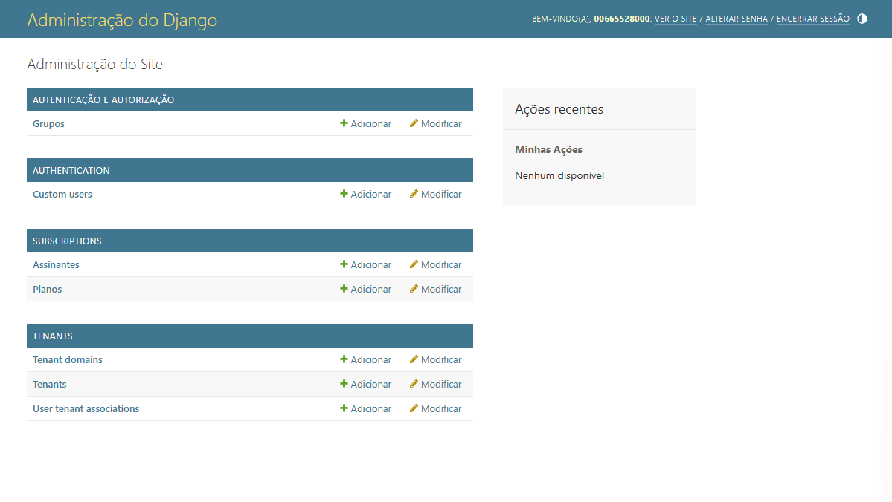
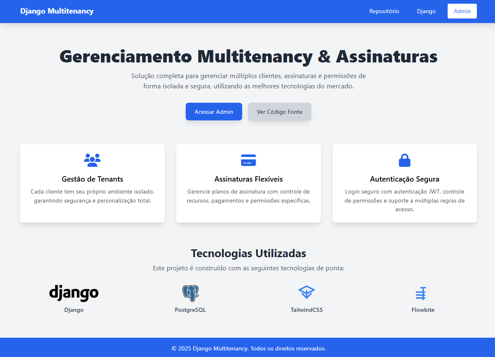

# Django Multitenancy + Subscriptions

## 📌 Visão Geral
Este projeto implementa um sistema **multitenant** em Django com suporte a **assinaturas (subscriptions)**. Cada tenant tem sua própria configuração e plano de assinatura, garantindo separação eficiente de dados e funcionalidades.

## 🚀 Tecnologias Utilizadas
- **Django** – Framework web para back-end.
- **PostgreSQL** – Banco de dados com suporte a múltiplos tenants.
- **Django REST Framework (DRF)** – API para comunicação entre frontend e backend.
- **Django Simple JWT** – Autenticação via JWT.
- **Django Extensions** – Ferramentas auxiliares para desenvolvimento.
- **Django Simple History** – Histórico de mudanças nos dados.

## 🎯 Funcionalidades
- 🌍 **Multitenancy:** Cada cliente tem um ambiente isolado.
- 💳 **Sistema de Assinaturas:** Controle de planos pagos por tenant.
- 🔑 **Autenticação e Permissões:** Controle de acesso baseado no tenant.
- 📊 **Administração Separada:** Interface administrativa específica para cada tenant.

## 🛠️ Como Rodar o Projeto Localmente

### 1️⃣ Clone o Repositório
```bash
git clone https://github.com/vivinfor/django-multitenancy-subscriptions.git
cd django-multitenancy-subscriptions
```

### 2️⃣ Crie um Ambiente Virtual e Instale as Dependências
```bash
python -m venv venv
source venv/bin/activate  # No Windows: venv\Scripts\activate
pip install -r requirements.txt
```

### 3️⃣ Configure as Variáveis de Ambiente
Crie um arquivo `.env` baseado no `.env.example` e configure os valores necessários:
```bash
cp .env.example .env
```
Edite o arquivo `.env` e adicione as configurações do banco de dados, chave secreta e outros detalhes.

### 4️⃣ Execute as Migrações do Banco de Dados
```bash
python manage.py migrate
```

### 5️⃣ Criar um Tenant
```bash
python manage.py shell
```
Em seguida, execute:
```python
from tenants.models import Tenant
Tenant.objects.create(name="Empresa1", is_active=True, is_subscribed=True)
```

### 6️⃣ Criar um Superusuário
```bash
python manage.py createsuperuser
```

### 7️⃣ Iniciar o Servidor
```bash
python manage.py runserver
```
Acesse: `http://127.0.0.1:8000/`

## 📌 Configuração de Assinaturas
O projeto permite gerenciar planos de assinatura diretamente pelo Django Admin. Para adicionar planos:
1. Acesse `/admin` e entre com seu superusuário.
2. Cadastre novos planos de assinatura em "Subscriptions > Plans".
3. Associe um plano ao tenant na interface de administração.

## 📸 Prints / Demonstração





## 🤝 Contribuições
Sinta-se à vontade para contribuir com este projeto! Basta seguir os passos:
1. Faça um fork do repositório.
2. Crie uma branch para sua funcionalidade (`git checkout -b minha-funcionalidade`).
3. Commit suas mudanças (`git commit -m 'Minha nova funcionalidade'`).
4. Envie para o repositório (`git push origin minha-funcionalidade`).
5. Abra um Pull Request!

## 📝 Licença
Este projeto está licenciado sob a **MIT License**.

🚀 Desenvolvido por [Viviana](https://github.com/vivinfor)

